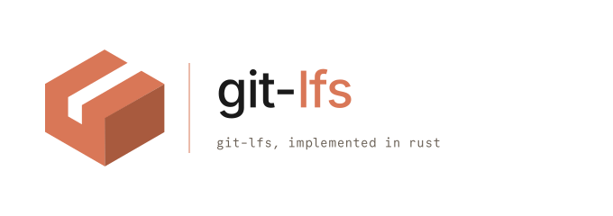

<picture>
  <source media="(prefers-color-scheme: dark)" srcset="docs/branding/banner-dark.svg">
  
</picture>

# Git Large File Storage

A from-scratch Rust port of [Git LFS](https://github.com/git-lfs/git-lfs).
The goal is feature parity with the upstream Go binary at the CLI and
wire-protocol level, with a clean library split and a better help output
in the binaries.

## Status

Work in progress. About 290 of the 790 vendored upstream shell tests
currently pass across 104 test files (~37%). The remaining gaps cluster
in commands that aren't started yet (`env`, `config`, `ext`, `dedup`,
custom transfer adapters, SSH) and in long-tail flag behavior on
otherwise-shipped commands. Day-to-day flows (clean / smudge,
`fetch` / `pull` / `push`, `track`, locking, `migrate`) work end to end
against authenticated LFS endpoints.

## Why

To be completely honest, the reason I started this was that I didn't
like how the help output of `git-lfs` looks, and I felt I could do
better. Naturally, instead of opening a pull request, I started
reimplementing the whole thing, as one does. And now that I've
started, quitting isn't an option — so Rust is gaining a native
git-lfs.

Jokes aside, implementing git-lfs has been quite a learning exercise.
It's more complex than I would have imagined, but it's also
well-scoped, and the upstream test suite is genuinely good. The aim
is reasonably clean Rust code that can serve as a basis for future
experimentation.

Down the line that could mean plugging into `gitoxide`'s `gix`, or
hosting Git LFS extensions — for example, content-defined chunking to
reduce how much data needs uploading when large files change.

## License

MIT, with attribution to the upstream Git LFS contributors. See
[LICENSE.md](LICENSE.md).
