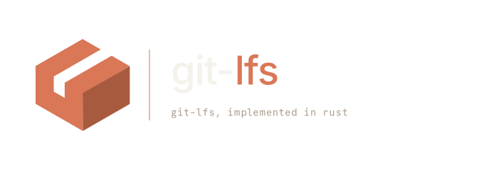

# Introduction

`git-lfs`, implemented in Rust. A from-scratch port of
[Git LFS](https://github.com/git-lfs/git-lfs), aiming for feature parity
with the upstream Go binary at the CLI and wire-protocol level — with a
cleaner library split and friendlier help output along the way.

These docs are split into three parts. **Protocol & format** mirrors the
vendored upstream specs (pointer files, batch API, locking, custom
transfer adapters, extensions). **Commands** and **Plumbing** are the
per-command reference. **Hooks**
documents the `post-*` / `pre-push` shims that `git lfs install` drops
into `.git/hooks/`.

The implementation is still in progress; see the project README for an
up-to-date snapshot of what works.

Git is a trademark of the [Software Freedom Conservancy](http://sfconservancy.org/).
